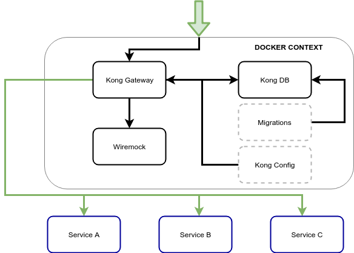

# As Built
The API Gateway with build in mocks runs within a docker compose context. Within this context are the following components:

1. Kong API Gateway which is the main entry point
2. The Kong db (postgresql) keeps track of the kong gateway state
3. Wiremock has all the mock requests matching and responses for all downstream services
4. Migrations initialises the kong database at start up
5. Kong config is a file based storage of the kong configuration which is loaded on start up.

_Illustration: Docker compose context_

## Contents
- [Technology](#technology)
- [Third party libraries](#third-party-libraries)
- [Compromises](#compromises)
- [Known Technical Debt](#known-technical-debt)

## Technology

### Docker & Docker compose
Nice easy way to bundle muliple services.

### Wiremock
Wiremock has a great request matching and a solid admin API to add scenarious dynamically.

## Third party libraries

## Compromises

## Known technical debt
